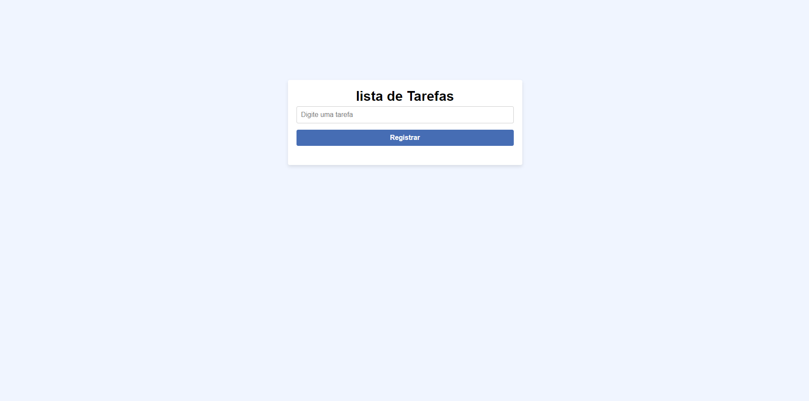
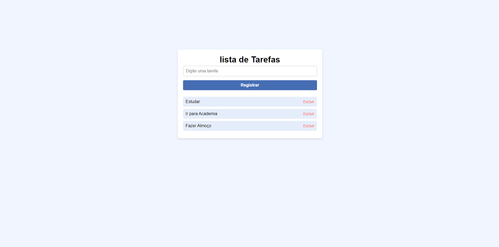

# Lista de Tarefas

## Descrição

Este projeto é uma aplicação simples de lista de tarefas (To-Do List) desenvolvida com HTML, CSS e JavaScript. A aplicação permite adicionar, listar e excluir tarefas, com persistência de dados usando `localStorage`.

## Funcionalidades

- **Adicionar Tarefas**: Insira uma tarefa na caixa de entrada e clique no botão "Registrar" para adicioná-la à lista.
- **Excluir Tarefas**: Clique em "Excluir" ao lado da tarefa para removê-la da lista.
- **Persistência de Dados**: As tarefas são salvas no `localStorage`, garantindo que os dados permaneçam mesmo após o fechamento do navegador.

## Tecnologias Utilizadas

- HTML5
- CSS3
- JavaScript

## Estrutura do Projeto

### Arquivos

- **`index.html`**: Estrutura HTML da aplicação.
- **`assets/CSS/style.css`**: Estilos principais da aplicação.
- **`assets/CSS/responsive.css`**: Estilos para responsividade.
- **`assets/JS/script.js`**: Lógica JavaScript para gerenciamento das tarefas.

## Funcionalidades Futuras

- **Implementação de Outras Listas**: Em breve será possível adicionar e gerenciar múltiplas listas de tarefas. Esta funcionalidade será ativada quando uma lista for selecionada.

- **Marcar Tarefa como Concluída**: Em breve será implementada uma funcionalidade que permitirá ao usuário marcar uma tarefa como "Concluída" ao clicar sobre ela, mudando sua aparência para indicar o status.